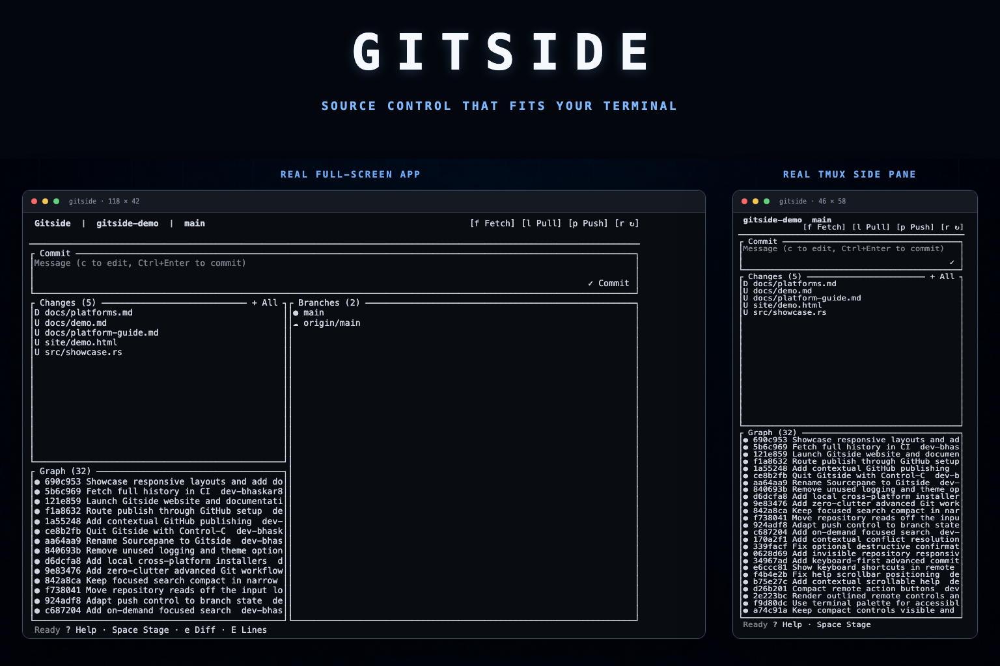

<p align="center">
  <br />
  
</p>

<p align="center"><sub>Actual Gitside output captured at 118×42 and 46×58 terminal cells.</sub></p>

<p align="center"><strong>Source control that fits your terminal.</strong></p>

<p align="center">
  A fast, mouse-friendly Git interface inspired by VS Code Source Control,<br />
  designed for full screens, narrow tmux panes, and everything between.
</p>

<p align="center">
  <a href="https://github.com/dev-bhaskar8/gitside/actions/workflows/ci.yml"></a>
  <a href="https://github.com/dev-bhaskar8/gitside/blob/main/LICENSE"></a>
  <a href="https://www.rust-lang.org"></a>
  <a href="https://github.com/dev-bhaskar8/gitside/stargazers"></a>
</p>

<p align="center">
  <a href="https://dev-bhaskar8.github.io/gitside/"><strong>Website</strong></a> ·
  <a href="https://dev-bhaskar8.github.io/gitside/docs/"><strong>Documentation</strong></a> ·
  <a href="CONTRIBUTING.md"><strong>Contributing</strong></a>
</p>

---

## Install

Gitside currently installs from source. You need Rust 1.85+ and Git 2.30+.

```sh
git clone https://github.com/dev-bhaskar8/gitside.git
cd gitside
cargo install --locked --path .
gitside
```

Pass a repository path from anywhere:

```sh
gitside /path/to/repository
```

## Why Gitside?

- **Made for side panes.** Changes and history remain useful in tall, narrow tmux layouts.
- **Mouse and keyboard.** Click controls in Ghostty and other SGR-capable terminals, or operate everything without a mouse.
- **A complete daily Git loop.** Stage files or hunks, commit, inspect history, manage branches, stash, sync, resolve conflicts, and work with worktrees.
- **GitHub when you need it.** Publish a repository, browse pull requests and issues, check out PRs, and inspect checks through the authenticated `gh` CLI.
- **Your terminal, your colors.** Gitside inherits the terminal background instead of painting an opaque theme over it.
- **Responsive and non-blocking.** Network work runs in the background and filesystem notifications keep repository state fresh.

## Essential controls

| Key | Action | Key | Action |
| --- | --- | --- | --- |
| `j` / `k` | Move | `Tab` | Next panel |
| `Space` | Stage / unstage | `Enter` | Open / activate |
| `c` | Commit message | `Ctrl+Enter` | Commit |
| `f` / `l` / `p` | Fetch / pull / push | `r` | Refresh |
| `g` / `b` / `h` | Graph / branches / GitHub | `/` | Search panel |
| `?` / `F1` | Contextual help | `q` / `Ctrl+C` | Quit |

The interface exposes specialized shortcuts only when they apply. See the
[complete controls](docs/controls.md) for conflict resolution, line staging,
worktrees, stashes, advanced commits, and remote workflows.

## GitHub publishing

Install and authenticate [GitHub CLI](https://cli.github.com/), then press `p`
when the repository has no remote. Gitside asks for the repository name,
visibility, and final confirmation before creating anything. It never creates
or pushes a remote repository automatically.

## Documentation

- [Getting started](https://dev-bhaskar8.github.io/gitside/docs/)
- [Controls](docs/controls.md)
- [Configuration](docs/configuration.md)
- [Platform support](docs/platforms.md)
- [Troubleshooting](docs/troubleshooting.md)
- [Architecture](docs/architecture.md)

## Support Gitside

If Gitside saves you time, you can support its development using this EVM
wallet address:

```text
0xC87efC9c71C422779F7dbeF14B2Fc4eef94b84fF
```

Verify that your chosen network and asset are compatible before sending.
Cryptocurrency transfers cannot be reversed. See [support details](docs/support.md).

## Development

```sh
cargo fmt --check
cargo clippy --all-targets -- -D warnings
cargo test
```

Read [CONTRIBUTING.md](CONTRIBUTING.md) before opening a pull request. Security
issues should follow [SECURITY.md](SECURITY.md).

## License

MIT © Gitside contributors
