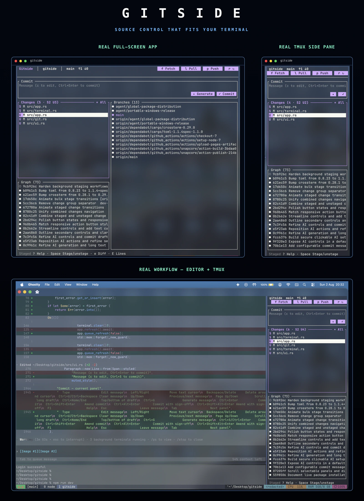

<p align="center">
  
</p>

<p align="center"><sub>Real Gitside sessions: narrow pane, wide terminal, and a live Ghostty/tmux workflow.</sub></p>

<p align="center"><strong>Source control that fits your terminal.</strong></p>

<p align="center">
  A fast, mouse-friendly Git interface inspired by VS Code Source Control,<br />
  designed for full screens, narrow tmux panes, and everything between.
</p>

<p align="center">
  <a href="https://github.com/dev-bhaskar8/gitside/actions/workflows/ci.yml"></a>
  <a href="https://github.com/dev-bhaskar8/gitside/blob/main/LICENSE"></a>
  <a href="https://www.rust-lang.org"></a>
  <a href="https://github.com/dev-bhaskar8/gitside/stargazers"></a>
</p>

<p align="center">
  <a href="https://dev-bhaskar8.github.io/gitside/"><strong>Website</strong></a> ·
  <a href="https://dev-bhaskar8.github.io/gitside/docs/"><strong>Documentation</strong></a> ·
  <a href="CONTRIBUTING.md"><strong>Contributing</strong></a>
</p>

---

## Install

Prebuilt packages are published for macOS, Linux, and Windows with each stable
release. Git 2.30+ is required at runtime.

### Cross-platform

#### npm

```sh
npm install --global gitside
```

The npm package installs the matching native binary.

#### Cargo

```sh
cargo install gitside --locked
```

Cargo builds Gitside from source and requires Rust 1.85 or newer.

### macOS and Linux

```sh
# Homebrew
brew install dev-bhaskar8/tap/gitside
```
### Windows

#### Chocolatey

```powershell
choco install gitside
```

The first Chocolatey version is currently in automated moderation review; use
the direct Windows installer below until that review completes.

#### Scoop

```powershell
scoop bucket add gitside https://github.com/dev-bhaskar8/scoop-bucket
scoop install gitside
```

### Direct downloads

Provenance-attested macOS, Linux, and Windows installers, portable archives,
`.deb`, and `.rpm` packages are available from
[GitHub Releases](https://github.com/dev-bhaskar8/gitside/releases/latest).
Chocolatey’s first version is in automated moderation review; use the direct
Windows installer until that review completes. See the
[installation matrix](docs/distribution.md#installation-matrix) for package
and architecture details.

Pass a repository path from anywhere:

```sh
gitside /path/to/repository
```

## Why Gitside?

- **Made for side panes.** Changes and history remain useful in tall, narrow tmux layouts.
- **Mouse and keyboard.** Click controls in Ghostty and other SGR-capable terminals, or operate everything without a mouse.
- **A complete daily Git loop.** Stage files or hunks, commit, inspect history, manage branches, stash, sync, resolve conflicts, and work with worktrees.
- **GitHub when you need it.** Publish a repository, browse pull requests and issues, check out PRs, and inspect checks through the authenticated `gh` CLI.
- **Your terminal, your colors.** Gitside inherits the terminal background instead of painting an opaque theme over it.
- **Responsive and non-blocking.** Network work runs in the background and filesystem notifications keep repository state fresh.
- **Optional commit drafts.** Configure offline rules, an existing Codex/Claude Code/OpenCode or other command, or a direct API inside the clickable AI panel. API keys stay in the OS keychain.

### AI commit drafts (optional)

Press `Y` to open the AI panel, choose Local, Agent, or API, then configure it
without editing TOML. `Ctrl+G` or the Generate button creates an editable,
Git-focused draft from staged changes (or the current working tree when nothing
is staged). Gitside never stages, commits, pushes, or changes branches during
generation. See the [AI configuration guide](docs/configuration.md#commit-message-generation).

## Same-repository benchmark

To compare the launch experience directly, I ran Gitside, lazygit, gitui, and
tig against this checkout (87 commits) in the same 118×42 tmux terminal on
macOS arm64. These are the medians of five launches. Time is measured to the
first usable screen, memory is process RSS at that point, and every run was
quit with `q`.

| Tool | Time to first UI | Memory (RSS) | Binary | Stability |
| --- | ---: | ---: | ---: | --- |
| `gitside` 0.1.2 | **0.75 s** | **10 MiB** | 5.2 MB | 5/5 clean exits |
| `gitui` 0.28.1-nightly | 0.16 s | 15 MiB | 10.0 MB | 5/5 clean exits |
| `lazygit` 0.63.1 | 0.27 s | 30 MiB | 18.6 MB | 5/5 clean exits |
| `tig` 2.6.1 | 0.15 s | 3.5 MiB | 0.7 MB | 5/5 clean exits |

This is an interactive launch comparison, not a full-history stress test.
Gitside loads a bounded history page initially and fetches more commits as you
scroll, so a 900k-commit repository should be benchmarked separately before
drawing conclusions about large-repository performance.

## Essential controls

| Key | Action | Key | Action |
| --- | --- | --- | --- |
| `j` / `k` | Move | `Tab` | Next panel |
| `Space` | Stage / unstage | `Enter` | Open / activate |
| `c` | Commit message | `Ctrl+S` / `Ctrl+Enter` | Commit |
| `Ctrl+U` / `Ctrl+Backspace` | Clear commit draft | `Ctrl+G` | Generate message draft |
| `Y` | Open AI panel | `f` / `l` / `p` | Fetch / pull / push |
| `r` | Refresh | `g` / `b` / `h` | Graph / branches / GitHub |
| `/` | Search panel | `?` / `F1` | Contextual help |
| `q` / `Ctrl+C` | Quit |  |  |

The interface exposes specialized shortcuts only when they apply. See the
[complete controls](docs/controls.md) for conflict resolution, line staging,
worktrees, stashes, advanced commits, and remote workflows.

## GitHub publishing

Install and authenticate [GitHub CLI](https://cli.github.com/), then press `p`
when the repository has no remote. Gitside asks for the repository name,
visibility, and final confirmation before creating anything. It never creates
or pushes a remote repository automatically.

## Documentation

- [Getting started](https://dev-bhaskar8.github.io/gitside/docs/)
- [Controls](docs/controls.md)
- [Configuration](docs/configuration.md)
- [Platform support](docs/platforms.md)
- [Troubleshooting](docs/troubleshooting.md)
- [Architecture](docs/architecture.md)
- [Packages and releases](docs/distribution.md)

## Support Gitside

If Gitside saves you time, you can support its development using this EVM
wallet address:

```text
0xC87efC9c71C422779F7dbeF14B2Fc4eef94b84fF
```

Verify that your chosen network and asset are compatible before sending.
Cryptocurrency transfers cannot be reversed. See [support details](docs/support.md).

## Development

```sh
cargo fmt --check
cargo clippy --all-targets -- -D warnings
cargo test
```

Read [CONTRIBUTING.md](CONTRIBUTING.md) before opening a pull request. Security
issues should follow [SECURITY.md](SECURITY.md).

## License

MIT © Gitside contributors
